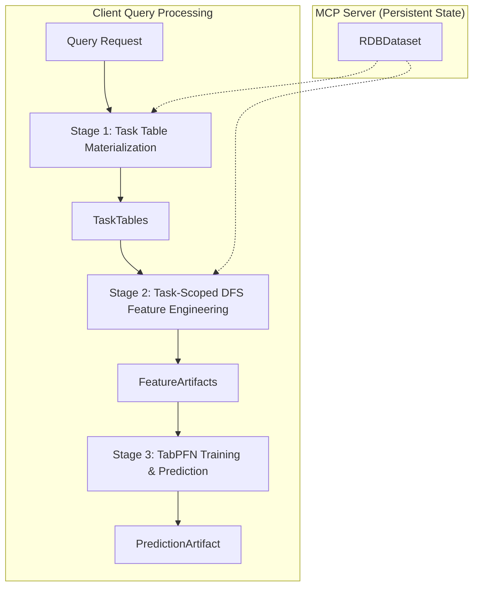

# Refactor Interface Design v002: MCP Server-Based Tabular Prediction Pipeline

## Overview

This document defines the interface specifications for the refactored MCP (Model Context Protocol) server-based 3-stage pipeline. The key improvements in v002 are:

1. **MCP Server Architecture**: RDB and schema are loaded once at server startup and persist across multiple client queries
2. **Consistent Schema**: Uses the fast_dfs.md RDBDataset structure throughout the system
3. **Optimized TableInfo Usage**: Server-persistent context with simplified inter-stage data flow

## 🏗️ MCP Server Architecture



## 📋 MCP Server Interface Specifications

### **Server Initialization**

#### **RDBDataset (from fast_dfs.md)**
```python
from typing import Dict, List, Tuple, Optional
import pandas as pd
from pathlib import Path

@dataclass
class RDBColumnSchema:
    """Column schema following fast_dfs.md specification."""
    name: str
    dtype: str  # "primary_key", "foreign_key", "datetime", "float", "category", etc.
    link_to: Optional[str] = None  # For foreign keys: "table.column"

@dataclass
class RDBTableSchema:
    """Table schema following fast_dfs.md specification."""
    name: str
    source: str
    columns: List[RDBColumnSchema]
    time_column: Optional[str] = None

@dataclass
class RDBMetadata:
    """RDB metadata following fast_dfs.md specification."""
    dataset_name: str
    tables: List[RDBTableSchema]

class RDBDataset:
    """Represents a relational database for feature engineering (from fast_dfs.md)."""
    
    def __init__(self, path: Path):
        self.path = path
        self.metadata: RDBMetadata = self._load_metadata()
        self.tables: Dict[str, pd.DataFrame] = self._load_tables()
    
    @property 
    def table_names(self) -> List[str]:
        """Get list of table names."""
        return list(self.tables.keys())
        
    def get_table(self, name: str) -> pd.DataFrame:
        """Get a table as a pandas DataFrame."""
        return self.tables[name]
        
    def get_table_metadata(self, name: str) -> RDBTableSchema:
        """Get metadata for a specific table."""
        return next(t for t in self.metadata.tables if t.name == name)
        
    def get_relationships(self) -> List[Tuple[str, str, str, str]]:
        """Get relationships as (child_table, child_col, parent_table, parent_col)."""
        relationships = []
        for table_schema in self.metadata.tables:
            for col_schema in table_schema.columns:
                if col_schema.dtype == "foreign_key" and col_schema.link_to:
                    parent_table, parent_col = col_schema.link_to.split(".")
                    relationships.append((table_schema.name, col_schema.name, parent_table, parent_col))
        return relationships
```

#### **MCP Server Initialization**
```python
class TabularPredictionMCPServer:
    """MCP Server for tabular prediction with persistent RDB state."""
    
    def __init__(self, rdb_path: str, config: Dict[str, Any]):
        """Initialize server with persistent RDB and configuration."""
        # Load RDB once at startup - this is the key optimization (PERSISTENT)
        self.rdb_dataset = RDBDataset(Path(rdb_path))
        
        # Store configuration for DFS and TabPFN (but don't initialize engines)
        self.dfs_config = config.get('dfs_config', {})
        self.tabpfn_config = config.get('tabpfn_config', {})
        
        # Current query context (changes per request)
        self.current_query_spec: Optional['QuerySpec'] = None
    
    async def handle_prediction_request(self, query_spec: 'QuerySpec') -> 'PredictionArtifact':
        """Handle client prediction request using persistent server state."""
        # Set current query context (changes with each user query)
        self.current_query_spec = query_spec
        return await self._execute_prediction_pipeline()
```

### **Simplified Query Interface**

#### **Input: QuerySpec (Simplified TableInfo)**
```python
@dataclass
class QuerySpec:
    """Simplified query specification - only essential information for the query."""
    # Core query parameters
    target_table: str                   # Target table name (e.g., "users", "customer")
    entity_ids: Optional[List[Any]]     # Specific entity IDs (None = all entities)
    id_column: str                      # Primary key column name
    ts_current: datetime                # Current timestamp for predictions
    label_spec: str                     # Python code for label generation
    task_type: Literal["classification", "regression"]
    
    # Optional query-specific overrides
    lookback_days: int = 365           # Days to look back for training snapshots
    horizon_days: int = 90             # Days to look forward for labels
    sampling_rate: float = 0.3         # Sampling rate for training data
    dfs_depth: int = 3                 # DFS feature generation depth
    
    # Query ID for tracking
    query_id: Optional[str] = None
```

## 📊 Optimized Pipeline Stages

### **Stage 1: Task Table Materialization**

#### **Input: QuerySpec + Server RDBDataset**
#### **Output: TaskTables**
```python
@dataclass
class TaskTables:
    """Task tables using RDBDataset structure."""
    train_table: pd.DataFrame          # Columns: [__id, __timestamp, __label, ...entity_features]
    test_table: pd.DataFrame           # Columns: [__id, __timestamp, __label=NULL, ...entity_features]

async def materialize_task_tables(
    server: 'TabularPredictionMCPServer'
) -> TaskTables:
    """
    Generate training and test tables using server's persistent RDB and current query.
    
    Args:
        server: MCP server instance (accesses persistent rdb_dataset and current_query_spec)
        
    Returns:
        TaskTables with train/test splits and entity features
    """
```

### **Stage 2: Task-Scoped DFS Feature Engineering**

#### **Input: TaskTables + Server DFS Engine**
#### **Output: FeatureArtifacts**
```python
@dataclass
class FeatureArtifacts:
    """Feature artifacts - clean data only."""
    train_features_table: pd.DataFrame  # Features for training rows
    test_features_table: pd.DataFrame   # Features for test rows

async def generate_task_features(
    task_tables: TaskTables,
    server: 'TabularPredictionMCPServer'
) -> FeatureArtifacts:
    """
    Generate DFS features using server's persistent RDB and current query.
    
    Args:
        task_tables: Train/test tables from Stage 1
        server: MCP server instance (accesses persistent rdb_dataset and current_query_spec)
        
    Returns:
        FeatureArtifacts with DFS features for train/test rows
    """
```

### **Stage 3: TabPFN Training & Prediction**

#### **Input: FeatureArtifacts + Server TabPFN Manager**
#### **Output: PredictionArtifact**
```python
@dataclass
class PredictionArtifact:
    """Prediction artifact - clean data only."""
    test_with_predictions: pd.DataFrame  # Columns: [__id, __timestamp, y_pred, y_prob (if classification)]

async def train_and_predict(
    feature_artifacts: FeatureArtifacts,
    server: 'TabularPredictionMCPServer'
) -> PredictionArtifact:
    """
    Train TabPFN model and generate predictions using server configuration and current query.
    
    Args:
        feature_artifacts: DFS features from Stage 2
        server: MCP server instance (accesses tabpfn_config and current_query_spec)
        
    Returns:
        PredictionArtifact with predictions
    """
```

## 🔄 Complete MCP Server Pipeline

```python
class TabularPredictionMCPServer:
    """MCP Server implementation with optimized pipeline."""
    
    async def _execute_prediction_pipeline(self) -> PredictionArtifact:
        """
        Execute the complete 3-stage prediction pipeline using persistent server state.
        
        Returns:
            Final prediction results
        """
        # Stage 1: Task Table Materialization (uses persistent rdb_dataset + current query)
        task_tables = await materialize_task_tables(self)
        
        # Stage 2: Task-Scoped DFS Feature Engineering (uses persistent rdb_dataset + current query)
        feature_artifacts = await generate_task_features(task_tables, self)
        
        # Stage 3: TabPFN Training & Prediction (uses persistent config + current query)
        prediction_artifact = await train_and_predict(feature_artifacts, self)
        
        return prediction_artifact
    
    # MCP Protocol Methods
    async def handle_mcp_request(self, request: Dict[str, Any]) -> Dict[str, Any]:
        """Handle incoming MCP requests."""
        if request.get("method") == "prediction/query":
            query_spec = QuerySpec(**request["params"])
            result = await self.handle_prediction_request(query_spec)
            return {"result": result}
        else:
            raise ValueError(f"Unknown method: {request.get('method')}")
```

## 📝 New Schema Definition (fast_dfs.md compliant)

### **metadata.yaml Structure**
```yaml
# New simplified metadata.yaml following fast_dfs.md specification
dataset_name: stackexchange_rdb
tables:
- name: users
  source: data/users.npz
  columns:
  - name: Id
    dtype: primary_key
  - name: AccountId
    dtype: int
  - name: CreationDate
    dtype: datetime
  - name: DisplayName
    dtype: string
  - name: Reputation
    dtype: int
    
- name: posts
  source: data/posts.npz
  columns:
  - name: Id
    dtype: primary_key
  - name: OwnerUserId
    dtype: foreign_key
    link_to: users.Id
  - name: CreationDate
    dtype: datetime
  - name: PostTypeId
    dtype: int
  - name: Score
    dtype: int
  - name: ViewCount
    dtype: int
  time_column: CreationDate
    
- name: comments
  source: data/comments.npz
  columns:
  - name: Id
    dtype: primary_key
  - name: PostId
    dtype: foreign_key
    link_to: posts.Id
  - name: UserId
    dtype: foreign_key
    link_to: users.Id
  - name: CreationDate
    dtype: datetime
  - name: Score
    dtype: int
  - name: Text
    dtype: string
  time_column: CreationDate
    
- name: votes
  source: data/votes.npz
  columns:
  - name: Id
    dtype: primary_key
  - name: PostId
    dtype: foreign_key
    link_to: posts.Id
  - name: UserId
    dtype: foreign_key
    link_to: users.Id
  - name: CreationDate
    dtype: datetime
  - name: VoteTypeId
    dtype: int
  time_column: CreationDate
    
- name: badges
  source: data/badges.npz
  columns:
  - name: Id
    dtype: primary_key
  - name: UserId
    dtype: foreign_key
    link_to: users.Id
  - name: Date
    dtype: datetime
  - name: Name
    dtype: string
  - name: Class
    dtype: int
  time_column: Date

# No tasks section - tasks are defined at runtime via QuerySpec
```

## 🎯 Example Usage with MCP Server

### **Server Startup**
```python
# Initialize MCP Server with persistent RDB
server_config = {
    "dfs_config": DFSConfig(
        max_depth=3,
        agg_primitives=["count", "mean", "max", "min", "std"],
        engine="dfs2sql"
    ),
    "tabpfn_config": {
        "model_type": "tabpfn_v2",
        "max_samples": 10000
    }
}

# Server loads RDB once at startup
mcp_server = TabularPredictionMCPServer(
    rdb_path="datasets/demo/rel-stack-input",
    config=server_config
)

# Server is now ready to handle multiple client queries
await mcp_server.start()
```

### **Client Query 1: Single User Engagement Prediction**
```python
# Client sends query to MCP server
query_spec = QuerySpec(
    target_table="users",
    entity_ids=[2666],
    id_column="Id",
    ts_current=datetime(2021, 1, 1),
    task_type="classification",
    label_spec="""
def create_table(
    tables: Dict[str, pd.DataFrame],
    timestamps: pd.Series[pd.Timestamp],
) -> pd.DataFrame:
    comments = tables['comments']
    votes = tables['votes']
    posts = tables['posts']
    users = tables['users']
    timestamp_df = pd.DataFrame({'timestamp': timestamps})
    timedelta = pd.Timedelta(days=365 // 4)
    
    return duckdb.sql(
        f'''
        WITH ALL_ENGAGEMENT AS (
            SELECT p.Id, p.OwnerUserId as UserId, p.CreationDate FROM posts p
            UNION
            SELECT v.Id, v.UserId, v.CreationDate FROM votes v
            UNION
            SELECT c.Id, c.UserId, c.CreationDate FROM comments c
        ),
        ACTIVE_USERS AS (
            SELECT t.timestamp, u.Id, count(distinct a.Id) as n_engagement
            FROM timestamp_df t
            CROSS JOIN users u
            LEFT JOIN ALL_ENGAGEMENT a ON u.Id = a.UserId and a.CreationDate <= t.timestamp
            WHERE u.Id != -1
            GROUP BY t.timestamp, u.Id
        )
        SELECT
            u.timestamp AS __timestamp,
            u.Id as __id,
            IF(count(distinct a.Id) >= 1, 1, 0) as __label
        FROM ACTIVE_USERS u
        LEFT JOIN ALL_ENGAGEMENT a ON u.Id = a.UserId 
            AND a.CreationDate > u.timestamp 
            AND a.CreationDate <= u.timestamp + INTERVAL '{timedelta}'
        WHERE u.n_engagement >= 1
        GROUP BY u.timestamp, u.Id
        '''
    ).df()
""",
    horizon_days=90,
    lookback_days=365,
    query_id="user_engagement_2666"
)

# Server processes query using persistent RDB (no reloading!)
result = await mcp_server.handle_prediction_request(query_spec)

print("Prediction Result:")
print(result.test_with_predictions)
#    __id  __timestamp  y_pred  y_prob
# 0  2666   2021-01-01    0.23    0.23

print(f"Model Metrics: {result.model_metrics}")
print(f"Features Used: {len(result.feature_importance)} features")
```

### **Client Query 2: Batch User Badge Prediction (Reuses Same RDB)**
```python
# Second client query - server reuses loaded RDB and schema
query_spec_2 = QuerySpec(
    target_table="users",
    entity_ids=None,  # All users
    id_column="Id",
    ts_current=datetime(2021, 1, 1),
    task_type="classification",
    label_spec="""
def create_table(
    tables: Dict[str, pd.DataFrame],
    timestamps: pd.Series[pd.Timestamp],
) -> pd.DataFrame:
    users = tables['users']
    badges = tables['badges']
    timestamp_df = pd.DataFrame({'timestamp': timestamps})
    timedelta = pd.Timedelta(days=365 // 4)
    
    return duckdb.sql(
        f'''
        SELECT
            t.timestamp AS __timestamp,
            u.Id AS __id,
            CASE WHEN COUNT(b.Id) >= 1 THEN 1 ELSE 0 END AS __label
        FROM timestamp_df t
        LEFT JOIN users u ON u.CreationDate <= t.timestamp
        LEFT JOIN badges b ON u.Id = b.UserId
            AND b.Date > t.timestamp
            AND b.Date <= t.timestamp + INTERVAL '{timedelta}'
        GROUP BY t.timestamp, u.Id
        '''
    ).df()
""",
    horizon_days=90,
    lookback_days=365,
    sampling_rate=0.1,  # Sample 10% of users
    query_id="batch_badge_prediction"
)

# Server processes second query - RDB already loaded, no I/O overhead!
result_2 = await mcp_server.handle_prediction_request(query_spec_2)

print("Batch Prediction Results:")
print(result_2.test_with_predictions.head())
#    __id  __timestamp  y_pred  y_prob
# 0     1   2021-01-01    0.85    0.85
# 1     2   2021-01-01    0.12    0.12
# 2     3   2021-01-01    0.67    0.67
```

## 🔄 Data Flow Optimizations

### **Stage 1 Process Flow (Optimized)**
1. **Use Server RDB**: Access pre-loaded `tables: Dict[str, pd.DataFrame]` from server state
2. **Parse label_spec**: Execute Python code with server's RDB tables
3. **Generate timestamps**: Create temporal snapshots using exponential backoff
4. **Apply sampling**: Sample entities based on `sampling_rate` and activity bias
5. **Create task tables**: Return TaskTables with minimal metadata for downstream stages

### **Stage 2 Process Flow (Optimized)**
1. **Use Server DFS Engine**: Access pre-initialized DFS engine with configuration
2. **Extract entity-timestamp pairs**: From TaskTables (no need to re-pass full QuerySpec)
3. **Generate DFS features**: Use server's RDB and DFS engine (no reloading!)
4. **Feature alignment**: Ensure consistent feature schema across train/test
5. **Return enhanced artifacts**: Include feature metadata for Stage 3

### **Stage 3 Process Flow (Optimized)**
1. **Use Server TabPFN Manager**: Access pre-initialized TabPFN manager
2. **Model training**: Fit TabPFN on train features and labels
3. **Cross-validation**: Generate model performance metrics
4. **Batch prediction**: Predict on test features
5. **Enhanced output**: Include model metrics, feature importance, and query tracking

## 🎯 Key Benefits of v002 Design

### **1. Performance Improvements**
- **No Repeated I/O**: RDB loaded once at server startup, reused across queries
- **Persistent State**: DFS engine and TabPFN manager initialized once
- **Reduced Memory**: No duplicate RDB copies for each query
- **Faster Queries**: Subsequent queries skip expensive loading phase

### **2. Architectural Improvements**
- **MCP Compliance**: Full Model Context Protocol server implementation
- **Consistent Schema**: Uses fast_dfs.md RDBDataset structure throughout
- **Simplified Interfaces**: QuerySpec contains only essential query parameters
- **Better Separation**: Clear distinction between server state and query state

### **3. Scalability Improvements**
- **Multi-Client Support**: Server can handle concurrent client requests
- **Resource Efficiency**: Shared RDB and engines across all queries
- **Stateful Optimization**: Server can cache intermediate results
- **Horizontal Scaling**: Multiple server instances can share RDB loading

### **4. Developer Experience**
- **Cleaner API**: Simplified QuerySpec vs. complex TableInfo
- **Better Debugging**: Query IDs and enhanced metadata for tracking
- **Consistent Types**: RDBDataset structure used throughout pipeline
- **Reduced Complexity**: Less data passing between stages

## 🔧 Implementation Migration Path

### **Phase 1: Core Infrastructure**
1. Implement RDBDataset class following fast_dfs.md specification
2. Create MCPServerState and TabularPredictionMCPServer classes
3. Update metadata.yaml format to match fast_dfs.md schema

### **Phase 2: Pipeline Optimization**
1. Refactor Stage 1 to use server's persistent RDB
2. Update Stage 2 to use server's DFS engine
3. Modify Stage 3 to use server's TabPFN manager

### **Phase 3: MCP Protocol Integration**
1. Implement full MCP protocol handlers
2. Add query tracking and metadata features
3. Implement concurrent request handling

### **Phase 4: Performance Optimization**
1. Add caching for intermediate results
2. Implement connection pooling for multiple clients
3. Add monitoring and metrics collection

This v002 design addresses all three requirements: MCP server architecture with persistent RDB/schema loading, consistent fast_dfs.md schema usage, and optimized TableInfo handling across pipeline stages.