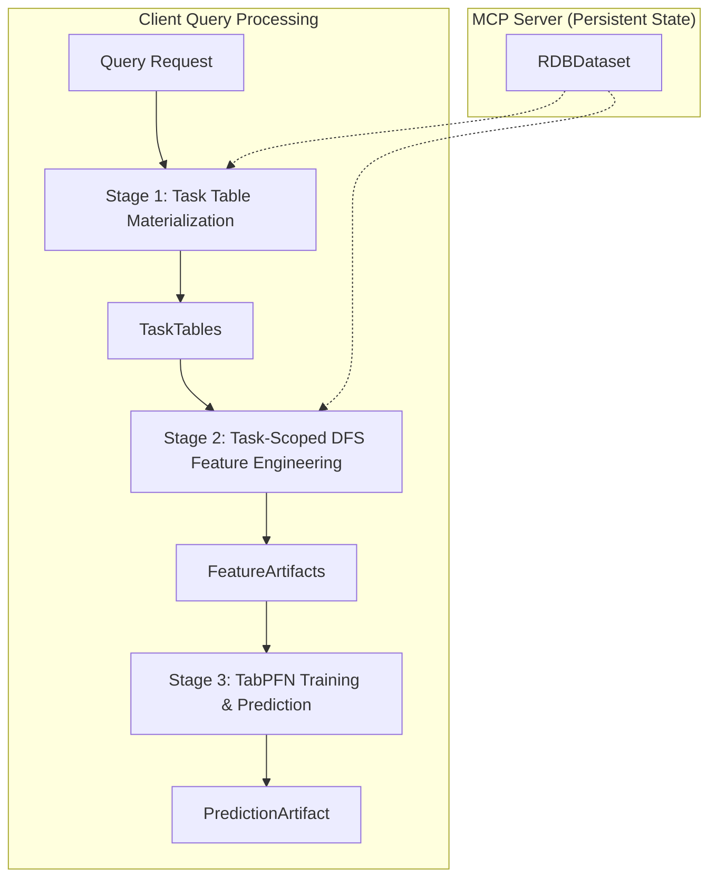

# Refactor Interface Design v002: MCP Server-Based Tabular Prediction Pipeline

## Overview

This document defines the interface specifications for the refactored MCP (Model Context Protocol) server-based 3-stage pipeline. The key improvements in v002 are:

1. **MCP Server Architecture**: RDB and schema are loaded once at server startup and persist across multiple client queries
2. **Consistent Schema**: Uses the fast_dfs.md RDBDataset structure throughout the system
3. **Optimized TableInfo Usage**: Server-persistent context with simplified inter-stage data flow

## 🏗️ MCP Server Architecture



## 📋 MCP Server Interface Specifications

### **Server Initialization**

#### **RDBDataset (from fast_dfs.md)**
```python
from typing import Dict, List, Tuple, Optional
import pandas as pd
from pathlib import Path

@dataclass
class RDBColumnSchema:
    """Column schema following fast_dfs.md specification."""
    name: str
    dtype: str  # "primary_key", "foreign_key", "datetime", "float", "category", etc.
    link_to: Optional[str] = None  # For foreign keys: "table.column"

@dataclass
class RDBTableSchema:
    """Table schema following fast_dfs.md specification."""
    name: str
    source: str
    columns: List[RDBColumnSchema]

@dataclass
class RDBMetadata:
    """RDB metadata following fast_dfs.md specification."""
    dataset_name: str
    tables: List[RDBTableSchema]

class RDBDataset:
    """Represents a relational database for feature engineering (from fast_dfs.md)."""
    
    def __init__(self, path: Path):
        self.path = path
        self.metadata: RDBMetadata = self._load_metadata()
        self.tables: Dict[str, pd.DataFrame] = self._load_tables()
    
    @property 
    def table_names(self) -> List[str]:
        """Get list of table names."""
        return list(self.tables.keys())
        
    def get_table(self, name: str) -> pd.DataFrame:
        """Get a table as a pandas DataFrame."""
        return self.tables[name]
        
    def get_table_metadata(self, name: str) -> RDBTableSchema:
        """Get metadata for a specific table."""
        return next(t for t in self.metadata.tables if t.name == name)
        
    def get_relationships(self) -> List[Tuple[str, str, str, str]]:
        """Get relationships as (child_table, child_col, parent_table, parent_col)."""
        relationships = []
        for table_schema in self.metadata.tables:
            for col_schema in table_schema.columns:
                if col_schema.dtype == "foreign_key" and col_schema.link_to:
                    parent_table, parent_col = col_schema.link_to.split(".")
                    relationships.append((table_schema.name, col_schema.name, parent_table, parent_col))
        return relationships
```

#### **MCP Server Initialization**
```python
class TabularPredictionMCPServer:
    """MCP Server for tabular prediction with persistent RDB state."""
    
    def __init__(self, rdb_path: str, config: Dict[str, Any]):
        """Initialize server with persistent RDB and configuration."""
        # Load RDB once at startup - this is the key optimization (PERSISTENT)
        self.rdb_dataset = RDBDataset(Path(rdb_path))
        
        # Store configuration for DFS and TabPFN (but don't initialize engines)
        self.dfs_config = config.get('dfs_config', {})
        self.tabpfn_config = config.get('tabpfn_config', {})
        
        # Current query context (changes per request)
        self.current_query_spec: Optional['QuerySpec'] = None
    
    async def handle_prediction_request(self, query_spec: 'QuerySpec') -> 'PredictionArtifact':
        """Handle client prediction request using persistent server state."""
        # Set current query context (changes with each user query)
        self.current_query_spec = query_spec
        return await self._execute_prediction_pipeline()
```

### **Simplified Query Interface**

#### **Input: QuerySpec (Simplified TableInfo)**
```python
@dataclass
class QuerySpec:
    """Optimized query specification using key_mapping for explicit entity definition."""
    # Core query parameters
    key_mapping: Dict[str, str]         # Maps task table IDs to RDB primary keys.
                                        # e.g., {"__id": "users.Id"} for classification
                                        # e.g., {"__id": "users.Id", "__target_id": "posts.Id"} for link prediction
    entity_ids: Optional[List[Any]]     # Specific entity IDs for the primary key (None = all entities)
    ts_current: datetime                # Current timestamp for predictions
    label_spec: str                     # Python code for label generation
    task_type: Literal["classification", "regression", "link prediction"]
    
    # Optional query-specific overrides
    horizon_days: int = 90             # Days to look forward for labels prediction
    sampling_rate: float = 0.3         # Sampling rate for training data
    dfs_depth: int = 3                 # DFS feature generation depth
    
    # Query ID for tracking
    query_id: Optional[str] = None
```

## 📊 Optimized Pipeline Stages

### **Stage 1: Task Table Materialization**

#### **Input: server: 'TabularPredictionMCPServer', containing query_spec and rdb_dataset**
#### **Output: TaskTables**
for details, see [materialize_task_tables.md](stage1-materialize_task_tables.md)
```python
@dataclass
class TaskTables:
    """Task tables using RDBDataset structure."""
    train_table: pd.DataFrame          # Columns: [__id, __timestamp, __label, ...entity_features]
    test_table: pd.DataFrame           # Columns: [__id, __timestamp, __label=NULL, ...entity_features]

async def materialize_task_tables(server: 'TabularPredictionMCPServer') -> TaskTables:
    # 1. Get context from the server
    query = server.current_query_spec
    rdb = server.rdb_dataset
    
    # Derive target table and primary key from key_mapping
    target_table, _ = query.key_mapping['__id'].split('.')
    target_table_df = rdb.get_table(target_table)
    target_table_schema = rdb.get_table_metadata(target_table)

    # 2. Generate historical timestamps for training
    timestamps = _generate_timestamps(
        ts_current=query.ts_current,
        rdb_dataset=rdb
    )

    # 3. Build the training table
    train_table = _materialize_training_table(
        query=query,
        rdb=rdb,
        timestamps=timestamps,
        target_table_df=target_table_df,
        target_table_schema=target_table_schema
    )

    # 4. Build the test table
    test_table = _materialize_test_table(
        query=query,
        target_table_df=target_table_df,
        target_table_schema=target_table_schema
    )

    # 5. Return the final TaskTables object
    return TaskTables(train_table=train_table, test_table=test_table)
```

### **Stage 2: Task-Scoped DFS Feature Engineering**

#### **Input: TaskTables + Server DFS Engine**
#### **Output: FeatureArtifacts**
for details, see [fast-dfs.md](stage2-fast-dfs.md)
```python
@dataclass
class FeatureArtifacts:
    """Feature artifacts - clean data only."""
    train_features_table: pd.DataFrame  # Features and labels for training rows
    test_features_table: pd.DataFrame   # Features for test rows

async def generate_task_features(task_tables: TaskTables, server: 'TabularPredictionMCPServer') -> FeatureArtifacts:
    # 1. Get context from the server
    query = server.current_query_spec
    rdb = server.rdb_dataset
    dfs_config = _merge_dfs_configs(server.dfs_config, query)
    
    # 2. Prepare cutoff time dataframes for train and test
    train_cutoff_df = _prepare_cutoff_time_df(
        task_tables.train_table,
        id_column="__id",
        time_column="__timestamp"
    )
    
    test_cutoff_df = _prepare_cutoff_time_df(
        task_tables.test_table,
        id_column="__id",
        time_column="__timestamp"
    )
    
    # 3. Apply transform pipeline to RDB
    transform_pipeline = _create_transform_pipeline()
    transformed_rdb = transform_pipeline(rdb)
    
    # 4. Use key mappings directly from the query
    key_mappings = query.key_mapping
    
    # 5. Generate features for train set
    train_features = _generate_features(
        transformed_rdb=transformed_rdb,
        target_df=train_cutoff_df,
        key_mappings=key_mappings,
        dfs_config=dfs_config
    )
    
    # 6. Generate features for test set with same feature set
    test_features = _generate_features(
        transformed_rdb=transformed_rdb,
        target_df=test_cutoff_df,
        key_mappings=key_mappings,
        dfs_config=dfs_config,
        feature_names=train_features.columns
    )
    
    # 7. Return the final FeatureArtifacts object
    return FeatureArtifacts(
        train_features_table=train_features,
        test_features_table=test_features
    )
```

### **Stage 3: TabPFN Training & Prediction**

#### **Input: FeatureArtifacts + Server TabPFN Manager**
#### **Output: PredictionArtifact**
for details, see [tabpfn-training-prediction.md](stage3-tabpfn-training-prediction.md)
```python
@dataclass
class PredictionArtifact:
    """Prediction artifact - clean data only."""
    test_with_predictions: pd.DataFrame  # Columns: [__id, __timestamp, y_pred, y_prob (if classification)]

async def train_and_predict(
    feature_artifacts: FeatureArtifacts,
    server: 'TabularPredictionMCPServer'
) -> PredictionArtifact:
    # 1. Get context from the server
    query = server.current_query_spec
    tabpfn_config = server.tabpfn_config
    
    # 2. Prepare training data
    train_X, train_y = _prepare_training_data(
        feature_artifacts.train_features_table,
        task_type=query.task_type
    )
    
    # 3. Train TabPFN model
    model = _train_tabpfn_model(
        train_X=train_X,
        train_y=train_y,
        task_type=query.task_type,
        tabpfn_config=tabpfn_config
    )
    
    # 4. Prepare test data
    test_X = _prepare_test_data(
        feature_artifacts.test_features_table,
        train_X_columns=train_X.columns
    )
    
    # 5. Generate predictions
    predictions = _generate_predictions(
        model=model,
        test_X=test_X,
        task_type=query.task_type
    )
    
    # 6. Format prediction results
    test_with_predictions = _format_prediction_results(
        test_df=feature_artifacts.test_features_table,
        predictions=predictions,
        task_type=query.task_type
    )
    
    # 7. Return the final PredictionArtifact object
    return PredictionArtifact(
        test_with_predictions=test_with_predictions
    )
```

## 🔄 Complete MCP Server Pipeline

```python
class TabularPredictionMCPServer:
    """MCP Server implementation with optimized pipeline."""
    
    async def _execute_prediction_pipeline(self) -> PredictionArtifact:
        """
        Execute the complete 3-stage prediction pipeline using persistent server state.
        
        Returns:
            Final prediction results
        """
        # Stage 1: Task Table Materialization (uses persistent rdb_dataset + current query)
        task_tables = await materialize_task_tables(self)
        
        # Stage 2: Task-Scoped DFS Feature Engineering (uses persistent rdb_dataset + current query)
        feature_artifacts = await generate_task_features(task_tables, self)
        
        # Stage 3: TabPFN Training & Prediction (uses persistent config + current query)
        prediction_artifact = await train_and_predict(feature_artifacts, self)
        
        return prediction_artifact
    
    # MCP Protocol Methods
    async def handle_mcp_request(self, request: Dict[str, Any]) -> Dict[str, Any]:
        """Handle incoming MCP requests."""
        if request.get("method") == "prediction/query":
            query_spec = QuerySpec(**request["params"])
            result = await self.handle_prediction_request(query_spec)
            return {"result": result}
        else:
            raise ValueError(f"Unknown method: {request.get('method')}")
```

## 📝 New Schema Definition (fast_dfs.md compliant)

### **metadata.yaml Structure**
```yaml
# New simplified metadata.yaml following fast_dfs.md specification
dataset_name: stackexchange_rdb
tables:
- name: users
  source: data/users.npz
  columns:
  - name: Id
    dtype: primary_key
  - name: AccountId
    dtype: int
  - name: CreationDate
    dtype: datetime
  - name: DisplayName
    dtype: string
  - name: Reputation
    dtype: int
    
- name: posts
  source: data/posts.npz
  columns:
  - name: Id
    dtype: primary_key
  - name: OwnerUserId
    dtype: foreign_key
    link_to: users.Id
  - name: CreationDate
    dtype: datetime
  - name: PostTypeId
    dtype: int
  - name: Score
    dtype: int
  - name: ViewCount
    dtype: int
    
- name: comments
  source: data/comments.npz
  columns:
  - name: Id
    dtype: primary_key
  - name: PostId
    dtype: foreign_key
    link_to: posts.Id
  - name: UserId
    dtype: foreign_key
    link_to: users.Id
  - name: CreationDate
    dtype: datetime
  - name: Score
    dtype: int
  - name: Text
    dtype: string
    
- name: votes
  source: data/votes.npz
  columns:
  - name: Id
    dtype: primary_key
  - name: PostId
    dtype: foreign_key
    link_to: posts.Id
  - name: UserId
    dtype: foreign_key
    link_to: users.Id
  - name: CreationDate
    dtype: datetime
  - name: VoteTypeId
    dtype: int
    
- name: badges
  source: data/badges.npz
  columns:
  - name: Id
    dtype: primary_key
  - name: UserId
    dtype: foreign_key
    link_to: users.Id
  - name: Date
    dtype: datetime
  - name: Name
    dtype: string
  - name: Class
    dtype: int

# No tasks section - tasks are defined at runtime via QuerySpec
```

## 🎯 Example Usage with MCP Server

### **Server Startup**
```python
# Initialize MCP Server with persistent RDB
server_config = {
    "dfs_config": DFSConfig(
        max_depth=3,
        agg_primitives=["count", "mean", "max", "min", "std"],
        engine="dfs2sql"
    ),
    "tabpfn_config": {
        "model_type": "tabpfn_v2",
        "max_samples": 10000
    }
}

# Server loads RDB once at startup
mcp_server = TabularPredictionMCPServer(
    rdb_path="datasets/demo/rel-stack-input",
    config=server_config
)

# Server is now ready to handle multiple client queries
await mcp_server.start()
```

### **Example Queries (3 types)**

### Full Example with detailed implementation


#### **Classification Query: User Engagement Prediction**
```python
# This query predicts whether a specific user (ID 2666) will engage
# (comment, vote, or post) within the next 90 days.
# Client sends a classification query to the MCP server
query_spec_classification = QuerySpec(
    key_mapping={"__id": "users.Id"},
    entity_ids=[2666],
    ts_current=datetime(2021, 1, 1),
    task_type="classification",
    label_spec="""
def create_table(
    tables: Dict[str, pd.DataFrame],
    timestamps: pd.Series[pd.Timestamp],
) -> pd.DataFrame:
    comments = tables['comments']
    votes = tables['votes']
    posts = tables['posts']
    users = tables['users']
    timestamp_df = pd.DataFrame({'timestamp': timestamps})
    timedelta = pd.Timedelta(days=90)
    
    # Complex label generation logic using duckdb
    return duckdb.sql(
        f'''
        WITH ALL_ENGAGEMENT AS (
            SELECT p.Id, p.OwnerUserId as UserId, p.CreationDate FROM posts p
            UNION
            SELECT v.Id, v.UserId, v.CreationDate FROM votes v
            UNION
            SELECT c.Id, c.UserId, c.CreationDate FROM comments c
        ),
        ACTIVE_USERS AS (
            SELECT t.timestamp, u.Id, count(distinct a.Id) as n_engagement
            FROM timestamp_df t
            CROSS JOIN users u
            LEFT JOIN ALL_ENGAGEMENT a ON u.Id = a.UserId and a.CreationDate <= t.timestamp
            WHERE u.Id != -1
            GROUP BY t.timestamp, u.Id
        )
        SELECT
            u.timestamp AS __timestamp,
            u.Id as __id,
            IF(count(distinct a.Id) >= 1, 1, 0) as __label
        FROM ACTIVE_USERS u
        LEFT JOIN ALL_ENGAGEMENT a ON u.Id = a.UserId
            AND a.CreationDate > u.timestamp
            AND a.CreationDate <= u.timestamp + INTERVAL '{timedelta}'
        WHERE u.n_engagement >= 1
        GROUP BY u.timestamp, u.Id
        '''
    ).df()
""",
    horizon_days=90,
    query_id="user_engagement_classification_2666"
)

# Server processes the query using the persistent RDB
# result_classification = await mcp_server.handle_prediction_request(query_spec_classification)
```

#### **Regression Query: Predicting Post Score**
```python
# This query predicts the score of all posts at a specific point in time.
# It samples 20% of the posts for the training data.
# Client sends a regression query to the MCP server
query_spec_regression = QuerySpec(
    key_mapping={"__id": "posts.Id"},
    entity_ids=None,  # All posts
    ts_current=datetime(2021, 1, 1),
    task_type="regression",
    label_spec="""
def create_table(
    tables: Dict[str, pd.DataFrame],
    timestamps: pd.Series[pd.Timestamp],
) -> pd.DataFrame:
    posts = tables['posts']
    timestamp_df = pd.DataFrame({'timestamp': timestamps})
    
    # Label is the score of the post
    return duckdb.sql(
        f'''
        SELECT
            t.timestamp AS __timestamp,
            p.Id AS __id,
            p.Score AS __label
        FROM timestamp_df t
        JOIN posts p ON p.CreationDate <= t.timestamp
        '''
    ).df()
""",
    horizon_days=0, # No horizon for this task
    sampling_rate=0.2,
    query_id="post_score_regression"
)

# Server processes the query, reusing the same RDB
# result_regression = await mcp_server.handle_prediction_request(query_spec_regression)
```

#### **Link Prediction Query: User-Post Interaction**
```python
# This query predicts whether a user will comment on a post in the next 30 days.
# This is a link prediction task where a "link" is a comment connecting a user and a post.
# Client sends a link prediction query to the MCP server
query_spec_link_prediction = QuerySpec(
    key_mapping={"__id": "users.Id", "__target_id": "posts.Id"},
    entity_ids=None, # We will generate candidate links
    ts_current=datetime(2021, 1, 1),
    task_type="link prediction",
    label_spec="""
def create_table(
    tables: Dict[str, pd.DataFrame],
    timestamps: pd.Series[pd.Timestamp],
) -> pd.DataFrame:
    users = tables['users']
    posts = tables['posts']
    comments = tables['comments']
    timestamp_df = pd.DataFrame({'timestamp': timestamps})
    timedelta = pd.Timedelta(days=30)

    # Generate candidate user-post pairs that do not have a comment yet.
    # Then, label them based on whether a comment appears in the future.
    return duckdb.sql(
        f'''
        WITH UserPostPairs AS (
            SELECT u.Id as UserId, p.Id as PostId, t.timestamp
            FROM users u
            CROSS JOIN posts p
            CROSS JOIN timestamp_df t
            WHERE u.CreationDate <= t.timestamp AND p.CreationDate <= t.timestamp
        ),
        ExistingComments AS (
            SELECT UserId, PostId, MIN(CreationDate) as FirstCommentDate
            FROM comments
            GROUP BY UserId, PostId
        )
        SELECT
            p.timestamp AS __timestamp,
            p.UserId AS __id,
            p.PostId AS __target_id,
            CASE
                WHEN e.FirstCommentDate IS NOT NULL AND e.FirstCommentDate > p.timestamp AND e.FirstCommentDate <= p.timestamp + INTERVAL '{timedelta}' THEN 1
                ELSE 0
            END AS __label
        FROM UserPostPairs p
        LEFT JOIN ExistingComments e ON p.UserId = e.UserId AND p.PostId = e.PostId
        WHERE e.FirstCommentDate IS NULL OR e.FirstCommentDate > p.timestamp -- Only consider pairs that haven't commented yet
        '''
    ).df()
""",
    horizon_days=30,
    query_id="user_post_link_prediction"
)

# Server processes the query, again reusing the RDB
# result_link_prediction = await mcp_server.handle_prediction_request(query_spec_link_prediction)
```

### End-to-End example
```python
"""
End-to-end example: Stage 1 -> Stage 2 -> Stage 3
- Shows how the MCP server orchestrates the pipeline using persistent RDBDataset
NOTE:
- This example assumes the following are available from your project:
  - RDBDataset, RDBMetadata, RDBTableSchema, RDBColumnSchema
  - QuerySpec, TaskTables, FeatureArtifacts, PredictionArtifact
  - materialize_task_tables, generate_task_features, train_and_predict
"""

import asyncio
from dataclasses import dataclass
from datetime import datetime
from typing import Any, Dict, Optional
import pandas as pd

# --------------------------
# MCP server skeleton (extended: store task_tables for Stage 3)
# --------------------------
class TabularPredictionMCPServer:
    def __init__(self, rdb_path: str, config: Dict[str, Any]):
        self.rdb_dataset = RDBDataset(Path(rdb_path))
        self.dfs_config = config.get("dfs_config", {})
        self.tabpfn_config = config.get("tabpfn_config", {})
        self.current_query_spec: Optional['QuerySpec'] = None
        # No need to persist TaskTables anymore for Stage 3

    async def handle_prediction_request(self, query_spec: 'QuerySpec') -> 'PredictionArtifact':
        self.current_query_spec = query_spec
        return await self._execute_prediction_pipeline()

    async def _execute_prediction_pipeline(self) -> 'PredictionArtifact':
        # Stage 1
        print("\n[Stage 1] Task Table Materialization: BEGIN")
        task_tables = await materialize_task_tables(self)
        # No need to store task_tables on the server instance
        print("[Stage 1] Task Table Materialization: END")
        
        # Stage 2
        print("\n[Stage 2] Task-Scoped DFS Feature Engineering: BEGIN")
        feature_artifacts = await generate_task_features(task_tables, self)
        print("[Stage 2] Task-Scoped DFS Feature Engineering: END")
        
        # Stage 3
        print("\n[Stage 3] TabPFN Training & Prediction: BEGIN")
        prediction_artifact = await train_and_predict(feature_artifacts, self)
        print("[Stage 3] TabPFN Training & Prediction: END\n")
        
        return prediction_artifact

# ---- Stage 1 ----
async def materialize_task_tables(server: 'TabularPredictionMCPServer') -> 'TaskTables':
    # Context
    query = server.current_query_spec
    rdb = server.rdb_dataset
    
    # Derive target table from key_mapping
    target_table, id_column = query.key_mapping['__id'].split('.')
    target_table_df = rdb.get_table(target_table)
    target_table_schema = rdb.get_table_metadata(target_table)

    trace(f"[Stage 1] Using target_table={target_table}, id_column={id_column}")
    timestamps = _generate_timestamps(query.ts_current, rdb)
    train_table = _materialize_training_table(query, rdb, timestamps, target_table_df, target_table_schema)
    test_table = _materialize_test_table(query, target_table_df, target_table_schema)

    trace(f"[Stage 1] Done. train_table.shape={train_table.shape}, test_table.shape={test_table.shape}\n")
    return TaskTables(train_table=train_table, test_table=test_table)

# ---- Stage 2  ----
async def generate_task_features(task_tables: 'TaskTables', server: 'TabularPredictionMCPServer') -> 'FeatureArtifacts':
    query = server.current_query_spec
    rdb = server.rdb_dataset
    dfs_config = _merge_dfs_configs(server.dfs_config, query)

    train_cutoff_df = _prepare_cutoff_time_df(task_tables.train_table, "__id", "__timestamp")
    test_cutoff_df = _prepare_cutoff_time_df(task_tables.test_table, "__id", "__timestamp")

    transform_pipeline = _create_transform_pipeline()
    transformed_rdb = transform_pipeline(rdb)

    key_mappings = query.key_mapping

    train_features = _generate_features(transformed_rdb, train_cutoff_df, key_mappings, dfs_config)
    test_features = _generate_features(transformed_rdb, test_cutoff_df, key_mappings, dfs_config, feature_names=train_features.columns)

    trace(f"[Stage 2] Done. train_features.shape={train_features.shape}, test_features.shape={test_features.shape}\n")
    return FeatureArtifacts(train_features_table=train_features, test_features_table=test_features)

# ---- Stage 3 ----
async def train_and_predict(feature_artifacts: 'FeatureArtifacts', server: 'TabularPredictionMCPServer') -> 'PredictionArtifact':
    query = server.current_query_spec
    tabpfn_config = server.tabpfn_config

    train_X, train_y = _prepare_training_data(feature_artifacts.train_features_table, task_type=query.task_type)
    model = _train_tabpfn_model(train_X, train_y, query.task_type, tabpfn_config)

    test_X = _prepare_test_data(feature_artifacts.test_features_table, train_X_columns=train_X.columns)
    predictions = _generate_predictions(model, test_X, query.task_type)

    test_with_predictions = _format_prediction_results(feature_artifacts.test_features_table, predictions, query.task_type)
    trace(f"[Stage 3] Done. predictions.shape={test_with_predictions.shape}\n")
    return PredictionArtifact(test_with_predictions=test_with_predictions)

# --------------------------
# Example: server startup + one classification query
# --------------------------
from pathlib import Path

async def demo_end_to_end():
    # Server startup (persistent RDB + config)
    server_config = {
        "dfs_config": {
            "max_depth": 3,
            "agg_primitives": ["count", "mean", "max", "min", "std"],
            "engine": "dfs2sql"
        },
        "tabpfn_config": {
            "model_type": "tabpfn_v2",
            "max_samples": 10000,
            "ensemble_size": 16,
            "device": "cpu"
        }
    }
    mcp_server = TabularPredictionMCPServer(
        rdb_path="datasets/demo/rel-stack-input",
        config=server_config
    )

    # Example classification query (user engagement)
    query_spec = QuerySpec(
        key_mapping={"__id": "users.Id"},
        entity_ids=[2666],
        ts_current=datetime(2021, 1, 1),
        task_type="classification",
        label_spec="""
def create_table(tables, timestamps):
    # The real code from your Stage 1 doc can be used here.
    import pandas as pd
    df = pd.DataFrame({
        '__timestamp': timestamps,
        '__id': [2666 for _ in range(len(timestamps))],
        '__label': [1 for _ in range(len(timestamps))]
    })
    return df
""",
        horizon_days=90,
        sampling_rate=0.3,
        dfs_depth=3,
        query_id="user_engagement_classification_2666"
    )

    print("\n[MCP] Handling prediction request...")
    result = await mcp_server.handle_prediction_request(query_spec)
    print("[MCP] Final PredictionArtifact:")
    print(result.test_with_predictions.head())

if __name__ == "__main__":
    asyncio.run(demo_end_to_end())
```

## 🔄 Data Flow Optimizations

### **Stage 1 Process Flow (Optimized)**
1. **Use Server RDB**: Access pre-loaded `tables: Dict[str, pd.DataFrame]` from server state
2. **Parse label_spec**: Execute Python code with server's RDB tables
3. **Generate timestamps**: Create temporal snapshots using exponential backoff
4. **Apply sampling**: Sample entities based on `sampling_rate` and activity bias
5. **Create task tables**: Return TaskTables with minimal metadata for downstream stages

### **Stage 2 Process Flow (Optimized)**
1. **Use Server DFS Engine**: Access pre-initialized DFS engine with configuration
2. **Extract entity-timestamp pairs**: From TaskTables (no need to re-pass full QuerySpec)
3. **Generate DFS features**: Use server's RDB and DFS engine (no reloading!)
4. **Feature alignment**: Ensure consistent feature schema across train/test
5. **Return enhanced artifacts**: Include feature metadata for Stage 3

### **Stage 3 Process Flow (Optimized)**
1. **Use Server TabPFN Manager**: Access pre-initialized TabPFN manager
2. **Model training**: Fit TabPFN on train features and labels
3. **Cross-validation**: Generate model performance metrics
4. **Batch prediction**: Predict on test features
5. **Enhanced output**: Include model metrics, feature importance, and query tracking

## 🎯 Key Benefits of v002 Design

### **1. Performance Improvements**
- **No Repeated I/O**: RDB loaded once at server startup, reused across queries
- **Persistent State**: DFS engine and TabPFN manager initialized once
- **Reduced Memory**: No duplicate RDB copies for each query
- **Faster Queries**: Subsequent queries skip expensive loading phase

### **2. Architectural Improvements**
- **MCP Compliance**: Full Model Context Protocol server implementation
- **Consistent Schema**: Uses fast_dfs.md RDBDataset structure throughout
- **Simplified Interfaces**: QuerySpec contains only essential query parameters
- **Better Separation**: Clear distinction between server state and query state

### **3. Scalability Improvements**
- **Multi-Client Support**: Server can handle concurrent client requests
- **Resource Efficiency**: Shared RDB and engines across all queries
- **Stateful Optimization**: Server can cache intermediate results
- **Horizontal Scaling**: Multiple server instances can share RDB loading

### **4. Developer Experience**
- **Cleaner API**: Simplified QuerySpec vs. complex TableInfo
- **Better Debugging**: Query IDs and enhanced metadata for tracking
- **Consistent Types**: RDBDataset structure used throughout pipeline
- **Reduced Complexity**: Less data passing between stages

## 🔧 Implementation Migration Path

### **Phase 1: Core Infrastructure**
1. Implement RDBDataset class following fast_dfs.md specification
2. Create MCPServerState and TabularPredictionMCPServer classes
3. Update metadata.yaml format to match fast_dfs.md schema

### **Phase 2: Pipeline Optimization**
1. Refactor Stage 1 to use server's persistent RDB
2. Update Stage 2 to use server's DFS engine
3. Modify Stage 3 to use server's TabPFN manager

### **Phase 3: MCP Protocol Integration**
1. Implement full MCP protocol handlers
2. Add query tracking and metadata features
3. Implement concurrent request handling

### **Phase 4: Performance Optimization**
1. Add caching for intermediate results
2. Implement connection pooling for multiple clients
3. Add monitoring and metrics collection

This v002 design addresses all three requirements: MCP server architecture with persistent RDB/schema loading, consistent fast_dfs.md schema usage, and optimized TableInfo handling across pipeline stages.