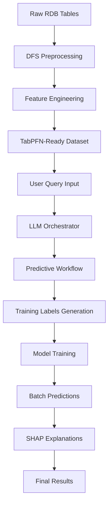
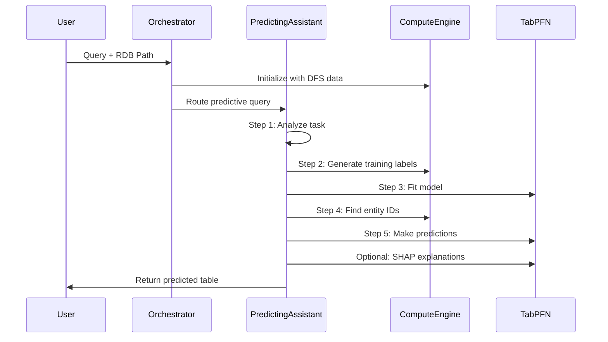

# Tabular Chat Predictor: End-to-End Data Processing Pipeline

Based on analysis of the tabular prediction system, here's the complete end-to-end data processing pipeline from user query + RDB path to predicted table with labels:

## 🏗️ High-Level Architecture Overview

## 📊 Complete Data Processing Pipeline

### **Stage 1: Data Preprocessing & Feature Engineering**

#### **Input**: Raw RDB Tables + Schema
- **Format**: Original relational database tables (`.pqt` files) + `metadata.yaml`
- **Example**: Amazon dataset with `customer.pqt`, `product.pqt`, `review.pqt`

#### **Process**: DFS (Deep Feature Synthesis) Pipeline
1. **Dataset Conversion** ([`convert_dataset.py`](convert_dataset.py)):
   - Loads raw tables and metadata
   - Generates temporal timestamps using exponential backoff
   - Identifies target tables (those with primary keys)
   - Applies sampling strategies:
     - **Static**: For tables without temporal data
     - **Creation-based**: For tables with time columns
     - **Activity-based**: For tables referenced by temporal tables

2. **Tab2Graph Processing** ([`run-dfs.sh`](run-dfs.sh)):
   - **Pre-DFS Transform**: Prepares data structure
   - **DFS Generation**: Creates deep features with depth=3
   - **Post-DFS Transform**: Optimizes for TabPFN consumption
   - **Output**: `.npz` files in `__dfs__/` directory

#### **Output**: DFS-Ready Dataset
- **Structure**: `datasets/demo/rel-amazon-input/__dfs__/customer.npz`
- **Content**: Feature matrices with temporal snapshots

### **Stage 2: Query Processing & Orchestration**

#### **Input**: User Query + Dataset Path
- **User Query**: Natural language (e.g., "Will user ID 1592898 churn next quarter?")
- **Dataset Path**: Path to DFS-processed dataset

#### **Process**: LLM-Driven Orchestration
1. **Initialization** ([`ComputeEngine`](tabular_chat_predictor/compute/compute_engine.py)):
   - Loads DFS features from `.npz` files
   - Initializes TabPFN managers for each target table
   - Sets up REPL environment with table data

2. **Query Analysis** ([`Orchestrator`](tabular_chat_predictor/agents/orchestrator.py)):
   - Uses LLM to analyze query intent
   - Decides between `coding_assistant_tool` or `predicting_assistant_tool`
   - Routes to appropriate workflow

### **Stage 3: Predictive Workflow Execution**

#### **Process**: 5-Step ML Pipeline ([`PredictingAssistant`](tabular_chat_predictor/agents/predicting_assistant.py))

**Step 1: Task Definition**
- **Input**: Natural language query
- **Process**: LLM analyzes query using ICL examples
- **Output**: 
  - `target_table_name` (e.g., "customer")
  - `task_type` ("classification" or "regression")
  - `training_label_description` (detailed instruction)

**Step 2: Training Labels Generation**
- **Tool**: [`make_training_labels()`](tabular_chat_predictor/agents/predicting_assistant.py:159)
- **Process**: 
  - Uses [`CodingAssistant`](tabular_chat_predictor/agents/coding_assistant.py) with specialized template
  - Generates Python code to create labels (like [`user_churn.py`](tabular_chat_predictor/icl_examples/amazon/user_churn.py))
  - Executes code in REPL environment
- **Output**: CSV file with `__id`, `__timestamp`, `__label` columns

**Step 3: Model Training**
- **Tool**: [`fit()`](tabular_chat_predictor/agents/predicting_assistant.py:220)
- **Process**: 
  - Loads training labels from CSV
  - Extracts features using [`TabPFNPredictor`](tabular_chat_predictor/compute/tabpfn_predictor.py)
  - Trains TabPFN model (classification/regression)
- **Output**: Fitted TabPFN model

**Step 4: Entity ID Discovery**
- **Tool**: [`coding_assistant()`](tabular_chat_predictor/agents/predicting_assistant.py:285)
- **Process**: 
  - LLM generates code to find relevant entity IDs
  - Executes queries against original tables
  - Saves entity IDs to CSV file
- **Output**: CSV file with entity IDs to predict

**Step 5: Batch Predictions**
- **Tool**: [`predict()`](tabular_chat_predictor/agents/predicting_assistant.py:238)
- **Process**: 
  - Loads entity IDs from CSV
  - Extracts features for each entity at test timestamp
  - Runs TabPFN predictions
- **Output**: CSV with `__id`, `__timestamp`, `__pred` columns

### **Stage 4: Results Processing & Explanation**

#### **Single Entity Queries**:
- **SHAP Analysis**: [`shap()`](tabular_chat_predictor/agents/predicting_assistant.py:262)
  - Generates feature importance explanations
  - Returns top contributing features

#### **Multiple Entity Queries**:
- **Post-processing**: Uses `coding_assistant` to aggregate results
- **Custom Analysis**: LLM generates code for specific query requirements

### **Stage 5: Final Output Generation**

#### **Output**: Predicted Table with Labels
- **Format**: CSV file or structured response
- **Content**: 
  - Entity IDs
  - Prediction timestamps
  - Predicted values/probabilities
  - Optional: SHAP explanations
  - Optional: Aggregated insights

## 🔄 Data Flow Summary

## 🎯 Key Technical Features

1. **Automated Feature Engineering**: DFS generates temporal features automatically
2. **LLM-Driven Orchestration**: Natural language queries converted to ML workflows
3. **Flexible Task Types**: Supports both classification and regression
4. **Scalable Predictions**: Batch processing for multiple entities
5. **Explainable AI**: SHAP integration for model interpretability
6. **Persistent REPL**: Code execution environment for custom analysis

## 📋 Pipeline Stage Summary

| Stage | Input | Process | Output |
|-------|-------|---------|---------|
| **Preprocessing** | Raw `.pqt` tables + `metadata.yaml` | DFS feature engineering via `run-dfs.sh` | `.npz` feature matrices |
| **Query Analysis** | Natural language query | LLM-driven task decomposition | Structured ML workflow |
| **Label Generation** | Task description | Code generation + execution | Training CSV |
| **Model Training** | Features + labels | TabPFN fitting | Trained predictor |
| **Prediction** | Entity IDs + model | Batch inference | Results CSV |
| **Explanation** | Predictions + model | SHAP analysis | Feature importance |

## 🎯 Final Summary & Key Insights

### **Data Processing Pipeline Overview**

The Tabular Chat Predictor implements a sophisticated **3-layer data processing architecture**:

1. **Data Layer**: Raw RDB → DFS Features → TabPFN-Ready Tensors
2. **Intelligence Layer**: LLM Orchestration → Task Planning → Code Generation
3. **ML Layer**: Training Labels → Model Fitting → Predictions → Explanations

### **Key Architectural Strengths**

1. **End-to-End Automation**: From raw tables to predictions without manual feature engineering
2. **Natural Language Interface**: Complex ML workflows triggered by conversational queries
3. **Temporal Awareness**: Sophisticated timestamp handling for time-series predictions
4. **Scalable Processing**: DuckDB optimization for large-scale data processing
5. **Explainable Results**: Built-in SHAP integration for model interpretability

### **Data Flow Characteristics**

- **Input Flexibility**: Handles various RDB schemas through metadata-driven processing
- **Feature Richness**: DFS generates deep temporal features automatically (depth=3)
- **Query Versatility**: Supports both single-entity and multi-entity prediction tasks
- **Result Completeness**: Returns predictions with timestamps, confidence, and explanations

This system effectively bridges the gap between raw relational data and actionable ML insights through intelligent orchestration and automated feature engineering.