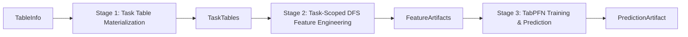

# Refactor Interface Design: Query-Driven Tabular Prediction Pipeline

## Overview

This document defines the interface specifications for the refactored 3-stage pipeline that moves from "DFS-first, then query" to "query-driven, on-demand DFS" approach.

## 🏗️ Pipeline Architecture



## 📋 Interface Specifications

### **Stage 1: Task Table Materialization**

#### **Input: TableInfo**
```python
@dataclass
class TableInfo:
    base_table: str                     # Base table name (e.g., "users", "customer")
    entity_ids: Optional[List[Any]]     # Specific entity IDs in base_table (None = all entities)
    id_column: str                      # Primary key column name (e.g., "Id", "customer_id")
    ts_current: datetime                # Current timestamp for predictions
    label_spec: str                     # Python code for label generation (see ICL examples)
    task_type: Literal["classification", "regression"]
    
    # Optional parameters
    lookback_days: int = 365           # Days to look back for training snapshots
    horizon_days: int = 90             # Days to look forward for labels
    sampling_rate: float = 0.3         # Sampling rate for training data
    dfs_depth: int = 3                 # DFS feature generation depth
```

#### **Output: TaskTables**
```python
@dataclass
class TaskTables:
    train_table: pd.DataFrame          # Columns: [__id, __timestamp, __label, ...entity_features]
    test_table: pd.DataFrame           # Columns: [__id, __timestamp, __label=NULL, ...entity_features]
```

#### **Function Signature**
```python
def materialize_task_tables(
    table_info: TableInfo,
    tables_path: str,
) -> TaskTables:
    """
    Generate training and test tables based on label specification.
    
    Args:
        table_info: Task specification with label generation code
        tables_path: Path to RDB tables directory
        
    Returns:
        TaskTables with train/test splits and entity features
    """
```

### **Stage 2: Task-Scoped DFS Feature Engineering**

#### **Input: TaskTables + TableInfo**

#### **Output: FeatureArtifacts**
```python
@dataclass
class FeatureArtifacts:
    train_features_table: pd.DataFrame  # Features for training rows
    test_features_table: pd.DataFrame   # Features for test rows
```

#### **Function Signature**
```python
def generate_task_features(
    task_tables: TaskTables,
    table_info: TableInfo,
    tables_path: str
) -> FeatureArtifacts:
    """
    Generate DFS features for specific entity-timestamp pairs in task tables.
    
    Args:
        task_tables: Train/test tables from Stage 1
        table_info: Original task specification (for DFS depth, etc.)
        tables_path: Path to RDB tables directory
        
    Returns:
        FeatureArtifacts with DFS features for train/test rows
    """
```

### **Stage 3: TabPFN Training & Prediction**

#### **Input: FeatureArtifacts + TableInfo**

#### **Output: PredictionArtifact**
```python
@dataclass
class PredictionArtifact:
    test_with_predictions: pd.DataFrame  # Columns: [__id, __timestamp, y_pred, y_prob (if classification)]
```

#### **Function Signature**
```python
def train_and_predict(
    feature_artifacts: FeatureArtifacts,
    table_info: TableInfo
) -> PredictionArtifact:
    """
    Train TabPFN model and generate predictions with optional explanations.
    
    Args:
        feature_artifacts: DFS features from Stage 2
        table_info: Task specification (task_type, etc.)
        
    Returns:
        PredictionArtifact with predictions and model metrics
    """
```

## 📊 Complete Pipeline Function

```python
def execute_prediction_pipeline(
    table_info: TableInfo,
    tables_path: str
) -> PredictionArtifact:
    """
    Execute the complete 3-stage prediction pipeline.
    
    Args:
        table_info: Task specification
        tables_path: Path to RDB tables directory
        
    Returns:
        Final prediction results
    """
    # Stage 1: Task Table Materialization
    task_tables = materialize_task_tables(table_info, tables_path)
    
    # Stage 2: Task-Scoped DFS Feature Engineering
    feature_artifacts = generate_task_features(task_tables, table_info, tables_path)
    
    # Stage 3: TabPFN Training & Prediction
    prediction_artifact = train_and_predict(feature_artifacts, table_info)
    
    return prediction_artifact
```

## 🎯 Example Use Cases

### **Example 1: Single User Engagement Prediction (StackExchange)**

```python
# Query: "Will user ID 2666 make any votes, posts or comments in the next quarter?"

table_info = TableInfo(
    base_table="users",
    entity_ids=[2666],
    id_column="Id",
    ts_current=datetime(2021, 1, 1),
    task_type="classification",
    label_spec="""
import pandas as pd
import numpy as np
import duckdb

def create_table(
    tables: dict[str, pd.DataFrame],
    timestamps: "pd.Series[pd.Timestamp]",
) -> pd.DataFrame:
    comments = tables['comments']
    votes = tables['votes']
    posts = tables['posts']
    users = tables['users']
    timestamp_df = pd.DataFrame({'timestamp': timestamps})
    timedelta = pd.Timedelta(days=365 // 4)
    
    return duckdb.sql(
        f'''
        WITH ALL_ENGAGEMENT AS (
            SELECT p.id, p.owneruserid as userid, p.creationdate FROM posts p
            UNION
            SELECT v.id, v.userid, v.creationdate FROM votes v
            UNION
            SELECT c.id, c.userid, c.creationdate FROM comments c
        ),
        ACTIVE_USERS AS (
            SELECT t.timestamp, u.id, count(distinct a.id) as n_engagement
            FROM timestamp_df t
            CROSS JOIN users u
            LEFT JOIN all_engagement a ON u.id = a.UserId and a.CreationDate <= t.timestamp
            WHERE u.id != -1
            GROUP BY t.timestamp, u.id
        )
        SELECT
            u.timestamp AS __timestamp,
            u.id as __id,
            IF(count(distinct a.id) >= 1, 1, 0) as __label
        FROM active_users u
        LEFT JOIN all_engagement a ON u.id = a.UserId 
            AND a.CreationDate > u.timestamp 
            AND a.CreationDate <= u.timestamp + INTERVAL '{timedelta}'
        WHERE u.n_engagement >= 1
        GROUP BY u.timestamp, u.id
        '''
    ).df()
""",
    horizon_days=90,
    lookback_days=365
)

# Execute pipeline
result = execute_prediction_pipeline(table_info, "datasets/demo/rel-stack-input")

# Or execute stages individually:
# Stage 1: Task Table Materialization
task_tables = materialize_task_tables(table_info, "datasets/demo/rel-stack-input")
print("Stage 1 - TaskTables:")
print(f"Train table shape: {task_tables.train_table.shape}")
print(f"Test table shape: {task_tables.test_table.shape}")
print("Train table sample:")
print(task_tables.train_table.head(3))
#    __id  __timestamp  __label  Id  AccountId  CreationDate
# 0  2666   2020-01-01        1  2666    123456    2019-05-15
# 1  2666   2020-04-01        0  2666    123456    2019-05-15
# 2  2666   2020-07-01        1  2666    123456    2019-05-15

print("Test table sample:")
print(task_tables.test_table.head(1))
#    __id  __timestamp  __label  Id  AccountId  CreationDate
# 0  2666   2021-01-01     None  2666    123456    2019-05-15

# Stage 2: Task-Scoped DFS Feature Engineering
feature_artifacts = generate_task_features(task_tables, table_info, "datasets/demo/rel-stack-input")
print("\nStage 2 - FeatureArtifacts:")
print(f"Train features shape: {feature_artifacts.train_features_table.shape}")
print(f"Test features shape: {feature_artifacts.test_features_table.shape}")
print("Train features sample:")
print(feature_artifacts.train_features_table.head(2))
#    __id  __timestamp  __label  posts_count_30d  votes_count_90d  comments_avg_length  ...
# 0  2666   2020-01-01        1               12               45                 67.3  ...
# 1  2666   2020-04-01        0                8               23                 52.1  ...

# Stage 3: TabPFN Training & Prediction
prediction_artifact = train_and_predict(feature_artifacts, table_info)
print("\nStage 3 - PredictionArtifact:")
print("Final predictions:")
print(prediction_artifact.test_with_predictions)
#    __id  __timestamp  y_pred  y_prob
# 0  2666   2021-01-01    0.23    0.23
```

### **Example 2: Batch User Badge Prediction (StackExchange)**

```python
# Query: "Which users are likely to receive new badges in the next quarter?"

table_info = TableInfo(
    base_table="users",
    entity_ids=None,  # All users in base_table
    id_column="Id",
    ts_current=datetime(2021, 1, 1),
    task_type="classification",
    label_spec="""
import pandas as pd
import numpy as np
import duckdb

def create_table(
    tables: dict[str, pd.DataFrame],
    timestamps: "pd.Series[pd.Timestamp]",
) -> pd.DataFrame:
    users = tables['users']
    badges = tables['badges']
    timestamp_df = pd.DataFrame({'timestamp': timestamps})
    timedelta = pd.Timedelta(days=365 // 4)
    
    return duckdb.sql(
        f'''
        SELECT
            t.timestamp AS __timestamp,
            u.Id AS __id,
            CASE WHEN COUNT(b.Id) >= 1 THEN 1 ELSE 0 END AS __label
        FROM timestamp_df t
        LEFT JOIN users u ON u.CreationDate <= t.timestamp
        LEFT JOIN badges b ON u.Id = b.UserID
            AND b.Date > t.timestamp
            AND b.Date <= t.timestamp + INTERVAL '{timedelta}'
        GROUP BY t.timestamp, u.Id
        '''
    ).df()
""",
    horizon_days=90,
    lookback_days=365,
    sampling_rate=0.1  # Sample 10% of users for training
)

# Execute pipeline
result = execute_prediction_pipeline(table_info, "datasets/demo/rel-stack-input")

# Expected output
print(result.test_with_predictions.head())
#    __id  __timestamp  y_pred  y_prob
# 0     1   2021-01-01    0.85    0.85
# 1     2   2021-01-01    0.12    0.12
# 2     3   2021-01-01    0.67    0.67
# ...
```

## 🔄 Data Flow Details

### **Stage 1 Process Flow**
1. **Parse label_spec**: Execute Python code to generate training labels
2. **Generate timestamps**: Create temporal snapshots using exponential backoff
3. **Apply sampling**: Sample entities based on `sampling_rate` and activity bias
4. **Create train table**: Rows with historical labels for model training
5. **Create test table**: Rows at `ts_current` with NULL labels for prediction

### **Stage 2 Process Flow**
1. **Extract entity-timestamp pairs**: From both train and test tables
2. **Generate DFS features**: For each (entity_id, timestamp) using specified depth
3. **Feature window calculation**: Use lookback period from each timestamp
4. **Feature alignment**: Ensure consistent feature schema across train/test

### **Stage 3 Process Flow**
1. **Model training**: Fit TabPFN on train features and labels
2. **Cross-validation**: Generate model performance metrics
3. **Batch prediction**: Predict on test features
4. **Feature importance**: Optional SHAP analysis for explanations

## 🎯 Key Benefits of Refactored Design

1. **Query-Driven Flexibility**: No need for pre-materialized DFS datasets
2. **Task-Scoped Efficiency**: Generate features only for relevant entity-timestamp pairs
3. **Clear Separation of Concerns**: Each stage has well-defined inputs/outputs
4. **Maintainable Interfaces**: Stable contracts enable independent stage development
5. **Scalable Architecture**: Supports both single-entity and batch predictions

This refactored design maintains the core ML pipeline while enabling flexible, on-demand data generation driven by specific prediction tasks.